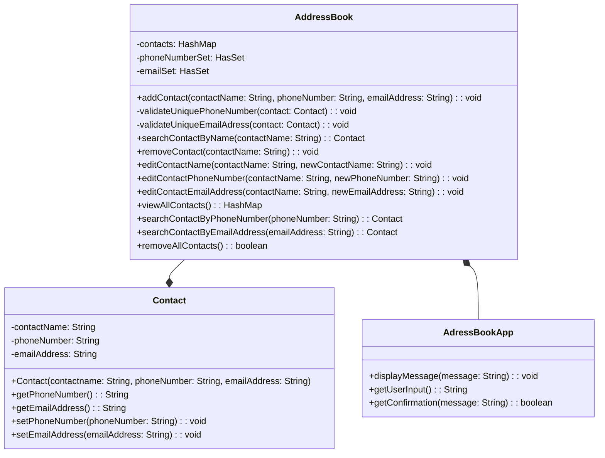

# Domain Models, Class Diagrams and Test Plan
## User Stories

### Core Features
**US1**\
As an Address Book app user, I want to be able to add a contact to the address book, so that I can maintain a record of 
the contacts, each containing a name, phone number and email address.\
**Tests**\
*Test 1* - Contact constructor sets expected values when valid: \
 1.1 - name can't be null, empty or whitespace, and it has more than 3 characters,\
 1.2 - phone number has 11 numbers\
 1.3 - email address has a correct format.\
*Test 2* -  When a contact is added to the address book, the contacts list contains that contact's details.

**US2**\
As an Address Book app user, I want to be able to search by a name, so that I can view the contact details associated 
with this name.
**Tests**
*Test 1* - When a name is provided, that contact's details are displayed.\

**US3**\
As an Address Book app user, I want to be able to remove a contact, so that I can maintain my record clean and updated.
**Tests**
*Test 1* - When a contact is removed from the list, it no longer appears in the contact list.\

**US4**\
As an Address Book app user, I want to be able to edit the contact's details, so that I can maintain my contact list
updated. 
**Tests**
*Test 1* - When the contact's name is changed, it is displayed accordingly in the contact list.
*Test 2* - When a contact's phone number is changed, this is displayed accordingly in the contact list.
*Test 3* - When a contact's email address is changed, this is displayed correctly in the contact list.

**US5**\
As an Address Book app user,I want the application to prevent duplicated phone numbers or emails to ensure accuracy in
my contact list and avoid errors.\
**Tests**
*Test 1*- When a contact with an already existing phone number is added to the list, the application throws an error.\  
*Test 2*- When a contact with an already existing email address is added to the list, the application throws an error.\
*Test 3*- When a contact is updated with an already existing phone number, the application throws an error.\
*Test 4*- When a contact is updated with an already existing email address, the application throws an error.\

**US6**\
As an Address Book app user, I want to be able to view my all contacts, to have a comprehensive overview about my
contact list.\
**Tests**
*Test 1* - When viewing all contacts, the application should present a detailed overview,
including name, phone number, and email address.\
*Test 2* - When the user views all contacts, the application should display a comprehensive list of contacts.\
*Test 3* - When there are no contacts in the address book, the application should notify the user that 
the contact list is empty.\

**US7**\
As an Address Book app user, I want to be able to interact with the system so that I can request information about my 
contact list.

## Class diagram

Figure 1: Initial Kanban Board

The Trello Kanban Board can be accessed at:
[Trello Board](https://trello.com/b/BPiPEQ8D/addressbook-challenge)