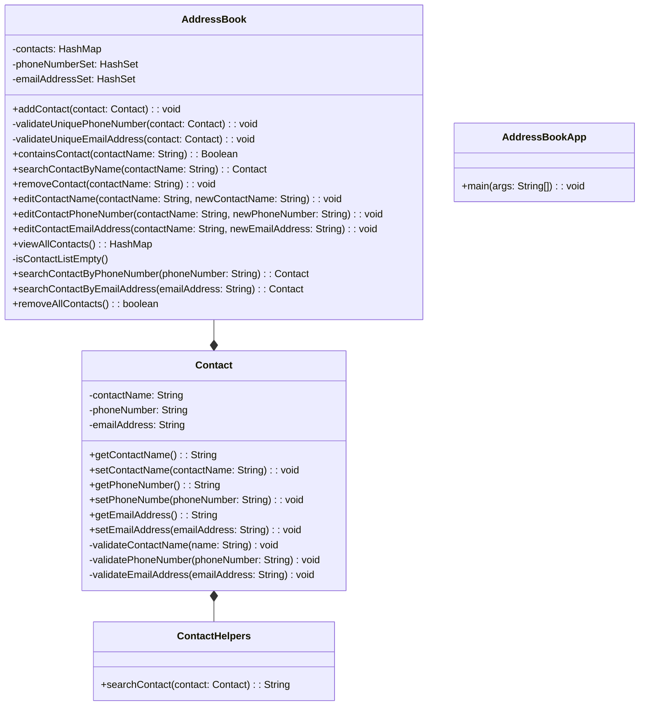

### Domain Models, Class Diagrams and Test Plan

## User Stories -> Class Diagram -> Tests

Content:
1. [Core Features](#core-features)

    1.1. [User Story 1](#us1-)

    1.2. [User Story 1: Tests](#us1--tests)

    1.3. [User Story 2](#us2)

    1.4. [User Story 2: Tests](#us2---tests)
    
    1.5. [User Story 3](#us3)
    
    1.6. [User Story 3: Tests](#us3---tests)

    1.7. [User Story 4](#us4)

    1.8. [User Story 4: Tests](#us4---tests)

    1.9. [User Story 5](#us5)

    1.10. [User Story 5: Tests](#us-5---tests)

    1.11. [User Story 6](#us6)

    1.12. [User Story 6: Tests](#us6---tests)

    1.13. [User Story 7](#us7)

    1.14. [User Story 7: Acceptance Test](#us7---acceptance-test)

2. [Class Diagram](#class-diagram)

3. [Additional Features](#additional-features)

    3.1. [User Story 8](#us8)

    3.2. [User Story 8: Tests](#us8---tests)

    3.3. [Notes about implementing the solution using GAI](#notes-about-implementing-the-solution-using-gai)

4. [Project Plan](#project-plan)

5. [Client Presentation: AddressBook Application](#client-presentation-addressbook-application)

    5.1. [The Addressed Problem](#the-addressed-problem)

    5.2. [The Proposed Solution](#the-proposed-solution)

    5.3. [Benefits for Company](#benefits-for-company)

    5.4. [Impact on The Business](#impact-on-the-business)

    5.5. [Conclusion](#conclusion)

# Core Features
## US1 
As an Address Book app user, I want to be able to add a contact to the address book, so that I can maintain a record of 
the contacts, each containing a name, phone number and email address.
### US1 -Tests
*Test 1* - Contact constructor sets expected values when valid: 
 1.1 - name can't be null, empty or whitespace, and it has more than 3 characters,\
 1.2 - phone number has 11 numbers\
 1.3 - email address has a correct format.\
*Test 2* -  When a contact is added to the address book, the contacts list contains that contact's details.

## US2
As an Address Book app user, I want to be able to search by a name, so that I can view the contact details associated 
with this name.
### US2 - Tests
*Test 1* - When a name is provided, that contact's details are displayed.

## US3
As an Address Book app user, I want to be able to remove a contact, so that I can maintain my record clean and updated.
### US3 - Tests
*Test 1* - When a contact is removed from the list, it no longer appears in the contact list.

## US4
As an Address Book app user, I want to be able to edit the contact's details, so that I can maintain my contact list
updated. 
### US4 - Tests
*Test 1* - When the contact's name is changed, it is displayed accordingly in the contact list.
*Test 2* - When a contact's phone number is changed, this is displayed accordingly in the contact list.\
*Test 3* - When a contact's email address is changed, this is displayed correctly in the contact list.

## US5
As an Address Book app user,I want the application to prevent duplicated phone numbers or emails to ensure accuracy in
my contact list and avoid errors.
### US 5 - Tests
*Test 1* - When a contact with an already existing phone number is added to the list, the application throws an error.  
*Test 2* - When a contact with an already existing email address is added to the list, the application throws an error.\
*Test 3* - When a contact is updated with an already existing phone number, the application throws an error.\
*Test 4* - When a contact is updated with an already existing email address, the application throws an error.

## US6
As an Address Book app user, I want to be able to view my all contacts, to have a comprehensive overview about my
contact list.
### US6 - Tests
*Test 1* - When viewing all contacts, the application should present a detailed overview,
including name, phone number, and email address.\
*Test 2* - When the user views all contacts, the application should display a comprehensive list of contacts.\
*Test 3* - When there are no contacts in the address book, the application should notify the user that 
the contact list is empty.

## US7
As an Address Book app user, I want to be able to interact with the system so that I can request information about my 
contact list.
### US7 - Acceptance Test

| Input                                     | Output                              |
|-------------------------------------------|-------------------------------------|
|                                           |                                     |
| Enter your choice: 1                      |                                     |
| Enter contact name: John Doe              |                                     |
| Enter phone number: 07894561231           |                                     |
| Enter email address: john.doe@example.com | Contact added successfully.         |
|                                           |                                     |
| Enter your choice: 4                      |                                     |
|                                           | All contacts:                       |
|                                           | Name: John Doe                      |
|                                           | Phone Number: 07894561231           |
|                                           | Email Address: john.doe@example.com |
|                                           |                                     |
| Enter your choice: 5                      |                                     |
|                                           | Exiting Address Book Application.   |

*Expected output:*\
Address Book Application

1. Add contact
2. Search contact by name
3. Remove contact
4. View all contacts
5. Exit
   Enter your choice: 1
   Enter contact name: John Doe
   Enter phone number: 07894561231
   Enter email address: john.doe@example.com
   Contact added successfully.

Address Book Application

1. Add contact
2. Search contact by name
3. Remove contact
4. View all contacts
5. Exit
   Enter your choice: 4
   All contacts:
   Name: John Doe
   Phone Number: 07894561231
   Email Address: john.doe@example.com

Address Book Application

1. Add contact
2. Search contact by name
3. Remove contact
4. View all contacts
5. Exit
   Enter your choice: 5
   Exiting Address Book Application.
---
# Class diagram

---
# Additional Features

## US8
As a user of the AddressBook app, I want to be able to search for a contact by their 
phone number so that I can quickly find and access their contact information.\
*Note:* This user story was created using GAI, and because the context offered 
and the problem are simpler, the answer was good, and I used it.\

\
Figure 1: ChatGPT user story proposal

### US8 - Tests
*Test 1* - When a phone number is provided, its contact's details are displayed.
*Test 2* - When a non-existing phone number is provided, no contact is displayed.\
*Note:* The ChatGPT offered a complex test format, but I wanted to maintain consistency 
and rephrase its response. However, the answer was still helpful.

\
Figure 2: ChatGPT tests proposal

### Notes about implementing the solution using GAI
1. The proposed JUnit test `testSearchContactByPhoneNumber` followed a good approach - Figure 3. 
I had to adapt this test because it did not match all the validations that I have 
implemented in the core feature of the Contact constructor. 
2. The method implementation was accurate after I provided the JUnit to GAI, which had the previous 
content of how the AddressBook attributes and behaviors were structured - Figure 4.
3. For Test2, it was easy to create the JUnit test because the GAI knew the context and had already provided 
a solution for implementing the `searchContactByPhoneNumber` method. The proposed test was then adapted 
for consistency in the testing environment.

\
Figure 3: ChatGPT JUnit test proposal for Test1

\
Figure 4: ChatGPT solution for`searchContactbyPhoneNumber`method

\
Figure 5: ChatGPT JUnit test proposal for Test1
---
# Project Plan

\
Figure 6: Initial Kanban Board

\
Figure 7: Day 3 Kanban Board

\
Figure 8: Day 4 Kanban Board

\
Figure 7: Final Kanban Board

The Trello Kanban Board can be accessed at:
[Trello Board](https://trello.com/b/BPiPEQ8D/addressbook-challenge)

---
# Client Presentation: AddressBook Application
This is a proposed solution for addressing the need for an efficient and reliable address book application. 
In this digital era, managing contacts effectively is crucial for personal and professional activities. This software 
prototype aims to streamline this process and offer various benefits to your business.

## The Addressed Problem

Based on the requirements provided by the Business Analyst team, some challenges were identified with the current
 contact management system. One significant issue is the lack of a centralized system, leading to duplicate entries 
and confusion. Another problem lies in the scattered nature of contact information, making it challenging to quickly 
locate specific details.

## The Proposed Solution

Our proposed address book application addresses these challenges by offering the following solutions:

*Centralized Contact Management* - This prototype implementation ensures efficient organization of all contact 
information in a single platform. For instance, taking advantages of using an efficient type of list - HashMap 
for storage in the application enables rapid search capabilities, enhancing the efficiency of the application.

*Duplicate Prevention* - The application incorporates built-in mechanisms to prevent duplicate entries by validating 
user inputs and enforcing specific formatting rules. It validates incoming contact details against existing ones, 
ensuring that duplicate phone numbers and email addresses are not added to the system. Utilizing data structures like 
HashSet, duplicate contact details are automatically detected and prevented. Additionally, the application's design, 
using HashSet as a data structure, serves as an index for searching phone numbers and email addresses, enhancing data 
accuracy and integrity.

*Efficient Search Functionality* - With intuitive search features, users swiftly access contact details, finding specific
contacts by name and efficiently retrieving desired information from centralized data structures. Using specialized 
data structures like HashMaps for indexing, the application facilitates rapid contact search, thereby enhancing both 
user experience and efficiency.

*Automated Data Maintenance* - The prototype implementation simplifies contact management tasks, ensuring seamless updates 
and removals of contact information. For example, any changes made to a contact's details are automatically reflected 
in the centralized storage, reducing manual effort and maintaining data integrity.

## Benefits for Company

By incorporating the application into your product catalogue, the company can reap numerous advantages:

*Improved Productivity* - This streamlined contact management system minimizes time spent on administrative tasks, 
empowering the one that are using it to concentrate on essential activities.

*Enhanced Precision* - With duplicate entry prevention and centralized data storage, the application ensures 
the accuracy and consistency of any contact information.

*Efficient Communication* - Rapid access to contact details facilitates smooth interactions with clients, partners, 
and team members, fostering efficient communication channels.

*Better Decision-Making* - Access to real-time contact information enables data-driven decision-making processes, 
contributing to improved strategic planning and business outcomes.

## Impact on The Business

The adoption of this application will have a significant positive impact on the business:

*Expanded Efficiency* - The AddressBook application optimizes contact management workflows, amplifying operational
efficiency and productivity. 

*Elevated Professionalism* - With dependable contact management, your users project an image of professionalism 
and trustworthiness, enhancing their brand reputation.

*Cost-Effective Operations* - Streamlined processes and decreased error rates translate into tangible cost savings, 
both in time and resources.

*Strengthened Customer Connections* - Prompt and precise communication enabled by this application fosters stronger 
bonds with customers and users, nurturing loyalty, and satisfaction.

*Revenue Generation Opportunities* - The flexibility of this application allows for customization to meet the specific 
needs of users. This opens avenues for selling the application as a standalone product or offering customized versions
tailored to individual customer requirements.

## Conclusion

In conclusion, the AddressBook prototype application offers a comprehensive solution for efficiently managing contacts,
catering to both personal and enterprise needs. By addressing various challenges and providing numerous benefits, this
software enhances productivity and organization, whether used by individuals or businesses. Additionally, its 
flexibility allows for optimization according to specific requirements, ensuring effectiveness across different usage
scenarios.

