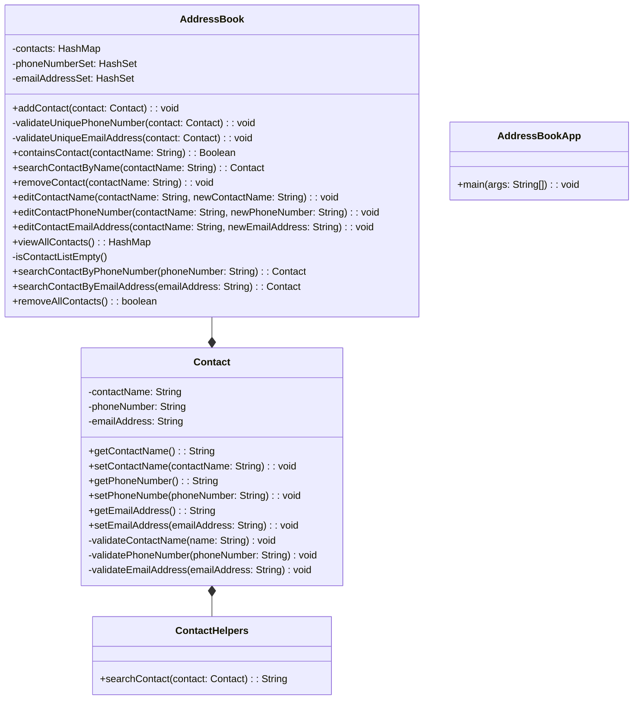

# Domain Models, Class Diagrams and Test Plan
## User Stories

### Core Features
**US1**\
As an Address Book app user, I want to be able to add a contact to the address book, so that I can maintain a record of 
the contacts, each containing a name, phone number and email address.\
**Tests**\
*Test 1* - Contact constructor sets expected values when valid: \
 1.1 - name can't be null, empty or whitespace, and it has more than 3 characters,\
 1.2 - phone number has 11 numbers\
 1.3 - email address has a correct format.\
*Test 2* -  When a contact is added to the address book, the contacts list contains that contact's details.

**US2**\
As an Address Book app user, I want to be able to search by a name, so that I can view the contact details associated 
with this name.
**Tests**
*Test 1* - When a name is provided, that contact's details are displayed.\

**US3**\
As an Address Book app user, I want to be able to remove a contact, so that I can maintain my record clean and updated.
**Tests**
*Test 1* - When a contact is removed from the list, it no longer appears in the contact list.\

**US4**\
As an Address Book app user, I want to be able to edit the contact's details, so that I can maintain my contact list
updated. 
**Tests**
*Test 1* - When the contact's name is changed, it is displayed accordingly in the contact list.
*Test 2* - When a contact's phone number is changed, this is displayed accordingly in the contact list.
*Test 3* - When a contact's email address is changed, this is displayed correctly in the contact list.

**US5**\
As an Address Book app user,I want the application to prevent duplicated phone numbers or emails to ensure accuracy in
my contact list and avoid errors.\
**Tests**
*Test 1*- When a contact with an already existing phone number is added to the list, the application throws an error.\  
*Test 2*- When a contact with an already existing email address is added to the list, the application throws an error.\
*Test 3*- When a contact is updated with an already existing phone number, the application throws an error.\
*Test 4*- When a contact is updated with an already existing email address, the application throws an error.\

**US6**\
As an Address Book app user, I want to be able to view my all contacts, to have a comprehensive overview about my
contact list.\
**Tests**
*Test 1* - When viewing all contacts, the application should present a detailed overview,
including name, phone number, and email address.\
*Test 2* - When the user views all contacts, the application should display a comprehensive list of contacts.\
*Test 3* - When there are no contacts in the address book, the application should notify the user that 
the contact list is empty.\

**US7**\
As an Address Book app user, I want to be able to interact with the system so that I can request information about my 
contact list.\
**Test**\
*Acceptance Test*\

| Input                                     | Output                              |
|-------------------------------------------|-------------------------------------|
|                                           |                                     |
| Enter your choice: 1                      |                                     |
| Enter contact name: John Doe              |                                     |
| Enter phone number: 07894561231           |                                     |
| Enter email address: john.doe@example.com | Contact added successfully.         |
|                                           |                                     |
| Enter your choice: 4                      |                                     |
|                                           | All contacts:                       |
|                                           | Name: John Doe                      |
|                                           | Phone Number: 07894561231           |
|                                           | Email Address: john.doe@example.com |
|                                           |                                     |
| Enter your choice: 5                      |                                     |
|                                           | Exiting Address Book Application.   |

*Expected output:*
Address Book Application

1. Add contact
2. Search contact by name
3. Remove contact
4. View all contacts
5. Exit
   Enter your choice: 1
   Enter contact name: John Doe
   Enter phone number: 07894561231
   Enter email address: john.doe@example.com
   Contact added successfully.

Address Book Application

1. Add contact
2. Search contact by name
3. Remove contact
4. View all contacts
5. Exit
   Enter your choice: 4
   All contacts:
   Name: John Doe
   Phone Number: 07894561231
   Email Address: john.doe@example.com

Address Book Application

1. Add contact
2. Search contact by name
3. Remove contact
4. View all contacts
5. Exit
   Enter your choice: 5
   Exiting Address Book Application.

## Class diagram

### Additional Features

**US8**\
As a user of the AddressBook app, I want to be able to search for a contact by their 
phone number so that I can quickly find and access their contact information.\
*Note:* This user story was created using GAI, and because the context offered 
and the problem are simpler, the answer was good, and I used it.\

\
Figure 1: ChatGPT user story proposal

**Tests**
*Test 1* - When a phone number is provided, its contact's details are displayed.\
*Test 2* - When a non-existing phone number is provided, no contact is displayed.\
*Note:* The ChatGPT offered a complex test format, but I wanted to maintain consistency 
and rephrase its response. However, the answer was still helpful.\

\
Figure 2: ChatGPT tests proposal

**Notes about implementing the solution using GAI**
1. The proposed JUnit test `testSearchContactByPhoneNumber` followed a good approach - Figure 3. 
I had to adapt this test because it did not match all the validations that I have 
implemented in the core feature of the Contact constructor. 
2. The method implementation was accurate after I provided the JUnit to GAI, which had the previous 
content of how the AddressBook attributes and behaviors were structured - Figure 4.
3. For Test2, it was easy to create the JUnit test because the GAI knew the context and had already provided 
a solution for implementing the `searchContactByPhoneNumber` method. The proposed test was then adapted 
for consistency in the testing environment.
4. 

\
Figure 3: ChatGPT JUnit test proposal for Test1

\
Figure 4: ChatGPT solution for`searchContactbyPhoneNumber`method

\
Figure 5: ChatGPT JUnit test proposal for Test1

\
Figure 1: Initial Kanban Board

The Trello Kanban Board can be accessed at:
[Trello Board](https://trello.com/b/BPiPEQ8D/addressbook-challenge)